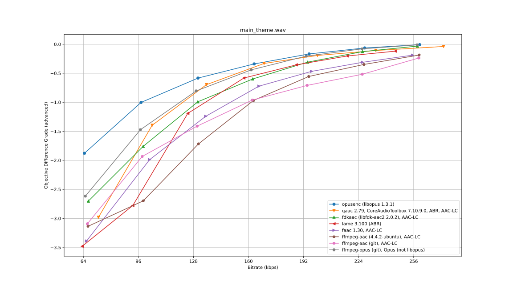

# peaqer.py

This is a Python-script to batch-en- and decode audio samples to generate graphs of audio metric scores.

## Example graph

This is a graph generated from ODG-scores as determined with [GstPEAQ](https://github.com/HSU-ANT/gstpeaq) as audio quality metric.

Note that objective audio metrics augment (but do not replace) actual listening tests. Automated metrics can provide approximate guidance, though.

## Requirements

- An audio quality measurement tool, such as [GstPEAQ](https://github.com/HSU-ANT/gstpeaq). The script `peaqer.py` derives its name from the [PEAQ](https://en.wikipedia.org/wiki/Perceptual_Evaluation_of_Audio_Quality) audio quality metric.
- Some audio en- and decoders, such as [Opus tools](https://github.com/xiph/opus-tools) or [LAME](https://lame.sourceforge.io/) etc.
- [FFmpeg](https://ffmpeg.org/)
- `python3`, with `matplotlib` installed. On Debian and Ubuntu, this can be obtained with the `python3-matplotlib` package, but installing via `pip` should be plenty fine as well.

## Method of operation

The script `peaqer.py` does not have any command line arguments - all settings regarding the encoding-experiments are set in `settings.json`.

Proposed workflow:

1. Assemble a directory with `.wav` files. For audio quality testing, usually rather short files with 5 to 20 seconds of audio content are employed.
1. Copy `settings.json` into that directory and customize it to your needs.
1. Start `peaqer.py` with the current workdir being the aforementioned directory with `.wav` files and `settings.json`.
1. Be patient while `peaqer.py` en- and decodes the samples files with all encoders and bitrates and invokes the configured audio quality metric tools. This can take a while.